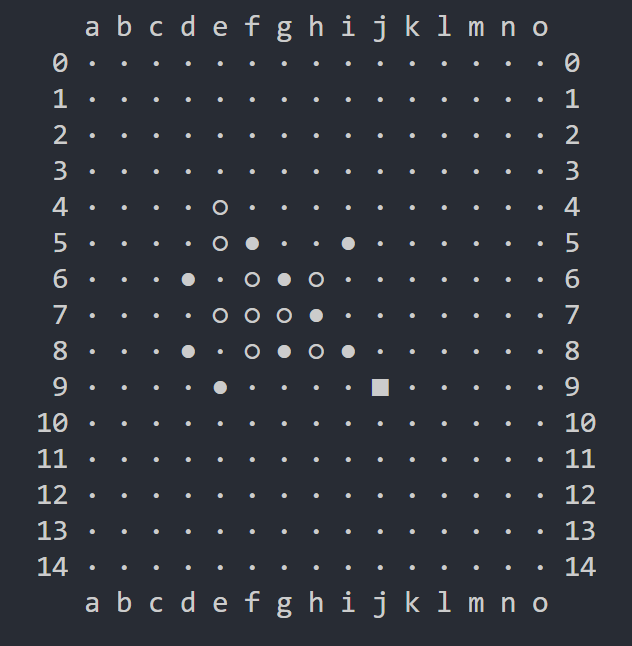
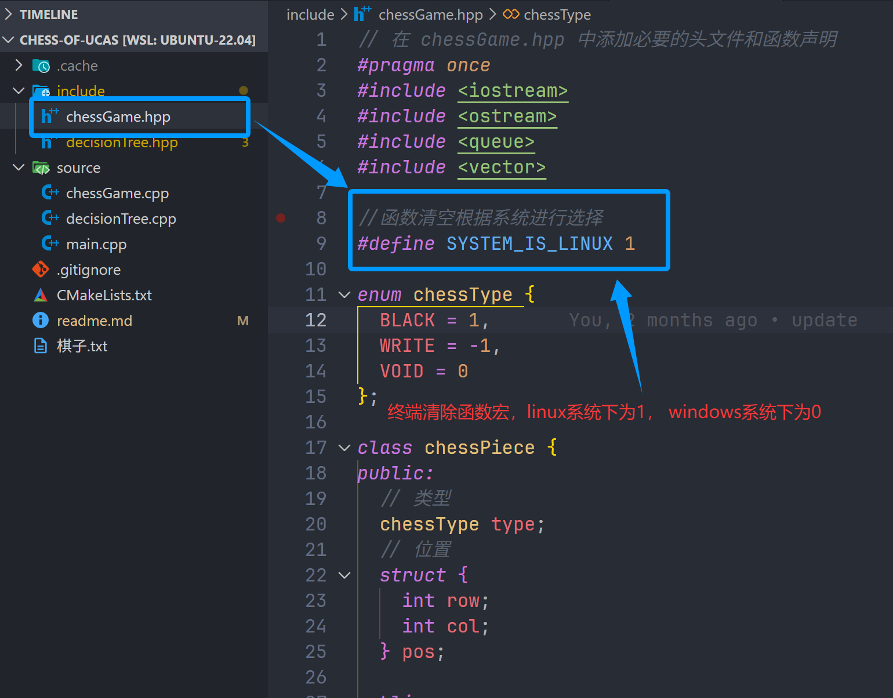
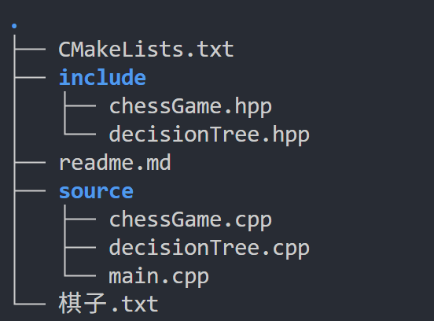

# 五子棋游戏 - C++实现



UCAS C++课程作业，实现了五子棋游戏的核心功能，支持双人对战与人机对战模式，具备完整的游戏逻辑与智能决策系统。


## 功能特性

### 基础功能
包含15×15标准棋盘布局，支持双人对战和人机对战两种模式。游戏过程中实时显示棋盘状态，包含坐标标记与棋子区分，并具备完善的输入合法性验证和胜负判定机制，确保游戏流程规范。

### 人工智能模块
基于决策树算法实现AI对战功能，通过Alpha-Beta剪枝优化搜索效率。内置棋盘状态评估函数，能根据棋子连线情况智能打分，并采用"优先棋子周围位置"的落子策略，默认搜索深度为3-4层，平衡决策质量与响应速度。


## 使用方法

### 编译步骤
编译前可根据操作系统修改宏定义（Linux/Windows）



```bash
mkdir build
cd build
cmake ..
make
```

### 运行方法

| 操作系统 | 运行命令    |
| -------- | ----------- |
| Linux    | ./chess.out |
| Windows  | ./chess.exe |


## 项目结构



项目采用模块化设计，主要包含以下文件结构：
- 核心逻辑：`source/chessGame.cpp`（游戏流程与棋盘管理）、`source/decisionTree.cpp`（AI决策实现）
- 头文件：`include/chessGame.hpp`、`include/decisionTree.hpp`
- 入口程序：`source/main.cpp`
- 构建配置：`CMakeLists.txt`


## 核心模块设计

### 1. 棋盘表示
- **数据结构**：采用一维数组存储15×15棋盘数据，简化坐标计算
- **棋子编码**：

| 棋子类型 | 编码值 | 显示符号（普通/最新） |
| -------- | ------ | --------------------- |
| 黑棋     | 1      | ● / ■                 |
| 白棋     | -1     | ○ / □                 |
| 空位     | 0      | ·（中心点为+）        |

- **坐标系统**：行索引0-14，列标识a-o（对应0-14）


### 2. 游戏逻辑类（chessGame）
负责棋盘初始化、状态管理与游戏流程控制。核心功能包括：
- 落子操作与历史记录（队列存储已落棋子位置）
- 胜负判定
- 双人/人机对战模式切换
- 棋盘显示


### 3. 胜负判定系统
采用八方向检测算法，以最新落子为中心，向四组相反方向延伸计数：

| 方向组   | 具体方向   |
| -------- | ---------- |
| 水平方向 | 左←→右     |
| 垂直方向 | 上↑↓下     |
| 主对角线 | 左上↖↘右下 |
| 副对角线 | 右上↗↙左下 |

当任意方向连续出现5个同色棋子时，判定该方胜利。


### 4. 人工智能模块（DecisionTree）
- **评估函数**：根据连线长度打分（五连100000分、四连1000分、三连100分、二连10分），区分AI与对手棋子进行分数加减
- **移动生成**：优先生成已有棋子周围的空位（取前20个最优位置提升性能），空棋盘时默认选择中心位置
- **搜索算法**：通过Alpha-Beta剪枝减少决策树搜索范围，提升AI响应速度

